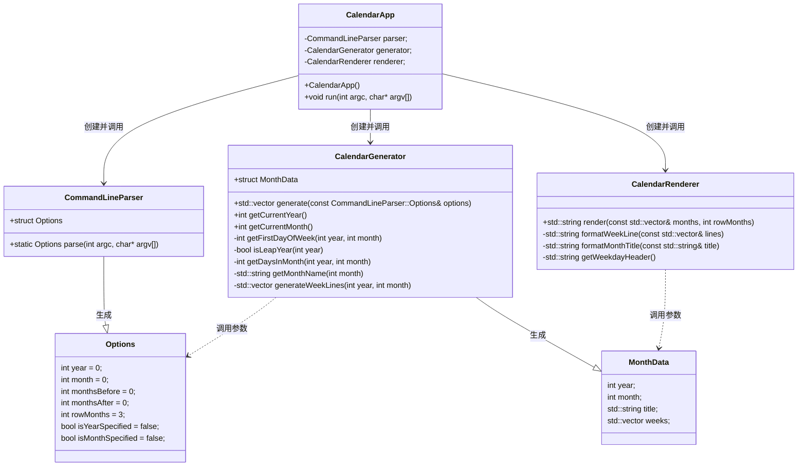
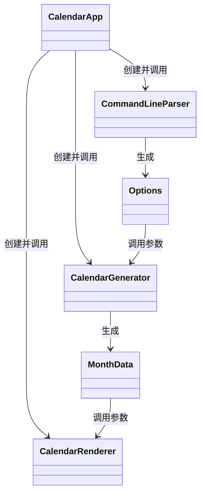

# 设计说明

23307110426 马颢宸

## 一、类图

## 二、类关系图

## 三、用例图

## 四、测试结果与样例

* 测试结果

* 测试样例

## 五、AI设计批评意见

* ==测试代码编写忽略实际程序行为==

  

  在AI工具编写的实际代码中，出现了测试`cal 2025 5 -A 2`、`cal 2025 5 -B 2`的语句。然而在通过在linux系统中运行这两条命令可知，此为非法命令：

  

  除此以外，AI工具在测试代码中还编写了例如`cal 2025 5`、`cal -d 2025 5`等非法命令

  总而言之，在编写相关代码时，AI工具错误理解了程序实际运行时应该解析的正确指令，并试图验证通过错误指令。

* ==忽视了对错误指令的处理与反馈==

  以错误指令`cal 2025 5`为例，在AI工具编写程序中，运行该指令，程序会返回公元5年的日历

  

  而在linux系统中运行该指令，程序会返回错误信息

  

  可以看出，AI编写工具忽视了对错误指令的处理及信息反馈机制。这也间接导致了上一问题（试图验证通过错误指令）的产生。

* ==忽视了真实历史的日历信息==

  在测试对比`cal 1`指令时发现，linux系统返回的日历与AI工具编写代码返回的日历有明显区别。但运行`cal 2025`指令，二者相同且符合现实信息。

  仔细检查后发现，在**1752年9月**的日历数据中，linux系统缺少了13天的数据信息，即**9/2之后的下一天为9/14**

  

​	而AI工具编写代码中，对应**日期正常递增**

​	查询相关信息后得知，这是由于**日历变换的相关历史**导致，即

​	而AI工具在编写相关指令时，未考虑实际历史的日历变换信息，从而在1752年的数据和真实数据有所出入，进而导致1752年及之前	的所有数据都有变动。

* ==排版调整不美观==

  在最初的AI设计版本中，输出的日历数据在排版上并不美观。

  日期与星期之间无法对齐，且空隙逐列递增；月份title无法正确居中，当一排显示多个月份时，title逐列偏右

  多次询问AI并要求其对齐排版后，仍无法正确输出美观的格式，最终还是依靠手动调整排版。

  总而言之，AI工具虽能写出正确实现程序功能的代码，但对于终端输出的美观与整洁却差强人意。